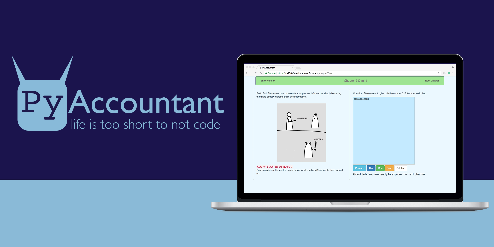

# PyAccountant 

A coding website designed for accountants to learn programming through an engaging and interactive story involving an accountant and demons. \
Our website is intended to facilitate learning the basics of programming in Python and also kindling an interest in programming by showing accountants the various ways in which Python can be used. \
This will allow accountants to automate their programming tasks and reduce dependence on close-source and expensive accounting software.\
Learn more on project website at http://pyaccountant.tyfeng.com/. 
